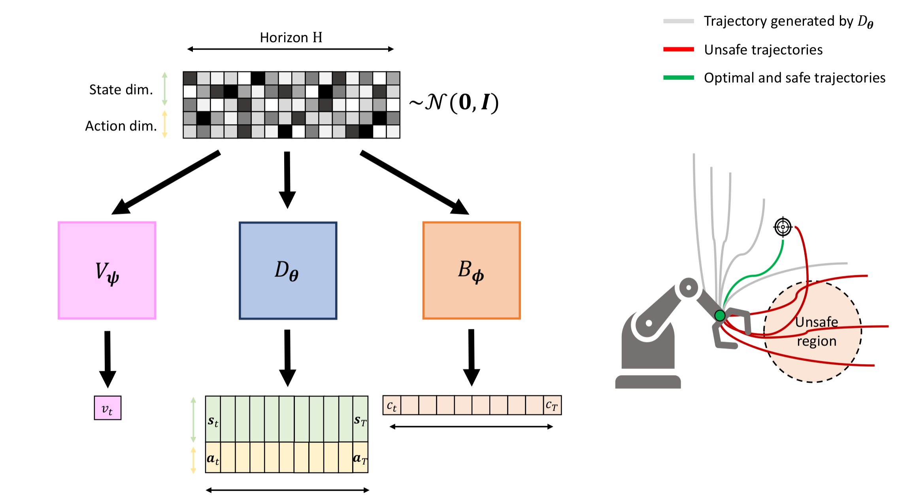

# Trajectory Generation, Control, and Safety with Denoising Diffusion Probabilistic Models

Code accompanying the paper:

**Trajectory Generation, Control, and Safety with Denoising Diffusion Probabilistic Models**\
Nicolò Botteghi, Federico Califano, Mannes Poel, Christoph Brune. \

The paper has been accepted at New Frontiers in Learning, Control, and Dynamical Systems - Workshop at the International Conference on Machine Learning (ICML) 2023. \
The paper can be found at: [Link](add link to arxiv). 



**Abstract:** 
We present a framework for safety-critical optimal control of physical systems based on denoising diffusion probabilistic models (DDPMs). The technology of control barrier functions (CBFs), encoding desired safety constraints, is used in combination with DDPMs to plan actions by iteratively denoising trajectories through a CBF-based guided sampling procedure. 
At the same time, the generated trajectories are also guided to maximize a future cumulative reward representing a specific task to be optimally executed.
The proposed scheme can be seen as an offline and model-based reinforcement learning algorithm resembling in its functionalities a model-predictive control optimization scheme with receding horizon in which the selected actions lead to optimal and safe trajectories.
## Requirements

The code is based on [Planning with Diffusion](https://github.com/jannerm/diffuser)

* Python 
* Pytorch 
* pip install -r requirements.txt

## Generate datasets

**Reacher**:
```bash
python generate_dataset_recher.py --test=False --seed=1

python generate_dataset_recher.py --test=True --seed=3
```

## Train the DDPM models
```bash
python train_DDPM.py
```

## Generate planning
```bash
python guided_planning.py
```

## Cite
If you use this code in your own work, please cite our paper:
```
@article{botteghi2022deep,
  title={Deep kernel learning of dynamical models from high-dimensional noisy data},
  author={Botteghi, Nicol{\`o} and Guo, Mengwu and Brune, Christoph},
  journal={Scientific reports},
  volume={12},
  number={1},
  pages={21530},
  year={2022},
  publisher={Nature Publishing Group UK London}
}

```